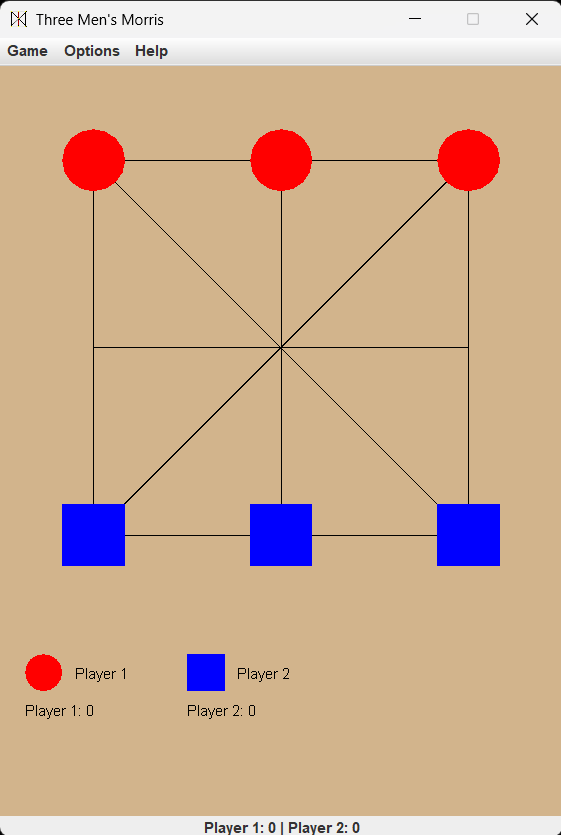

# three-mens-morris-desktop
Version: 1.0  
Developer: Muhammad Mubashir Shafique  
A modified version of the classic Three Men's Morris game built using Java Swing. This version features diagonal movement and does not allow capturing opponent's pieces.
🎮 A modern, polished remake of a childhood classic – built completely using Java Swing and terminal-only compilation! This game brings the nostalgic fun of *Three Men's Morris* (also known as Nine Holes) with added modern features like network play, animated splash screen, and score tracking.

---

## 🧩 Features

- 🎨 Interactive GUI (Java Swing)
- 👥 Local multiplayer (2 players)
- 🌐 Network multiplayer (Host/Join with IP)
- 🖌 Change player names and colors
- 📊 Scoreboard with win tracking
- 💡 Restart option after win
- 🎬 Splash screen with animated progress
- 🗂 Single-file source code (terminal-run friendly)

---

## 🕹 How to Play

- Each player starts with 3 pieces.
- Goal: Line up all 3 pieces in a row (horizontal, vertical, or diagonal).
- You **must move all pieces at least once** before winning is allowed.
- Pieces move to adjacent squares (including diagonals).
- First to align 3 wins!

---

## 🚀 How to Run

### 🔧 Option 1: Installer (Recommended)

Download the `.exe` or `.jar` installer from the [Releases](https://github.com/Muhammad-Mubashir-Shafique/three-mens-morris-desktop/releases) section and double-click to launch the game.

### ⚙️ Option 2: Terminal

If you want to run from source:

1. Make sure you have Java installed (`java -version`)
2. Save the source code as `Three_Mens_Morris.java`
3. Compile:
   ```bash
   javac Three_Mens_Morris.java
   ```
4. Run:
   ```bash
   java Three_Mens_Morris
   ```

---

## 📡 Network Play

1. One player selects **"Network Game" → "Host Game"**
2. Other player selects **"Network Game" → "Join Game"** and enters host’s IP
3. Both players must be on the same LAN/WiFi

---

## 📷 Screenshots

### 🎮 Gameplay


---

## 🙌 Credits

- Developed with 💻 by **Muhammad Mubashir Shafique**
- Inspired by childhood memories of traditional board games

---
